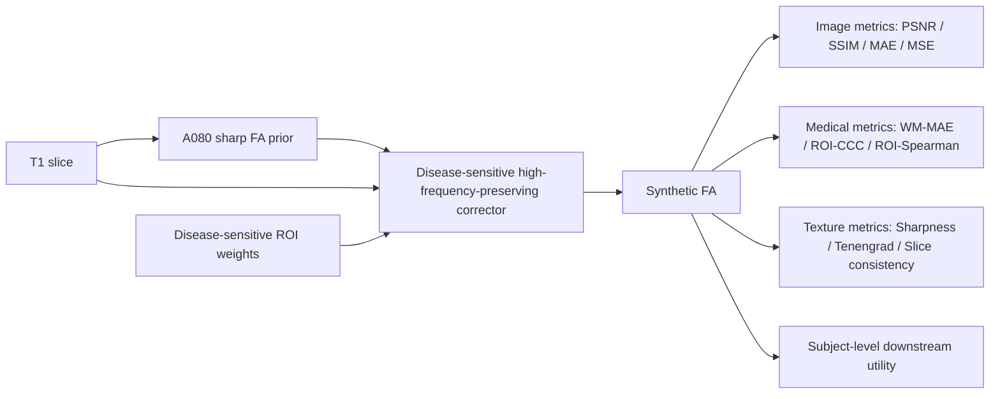
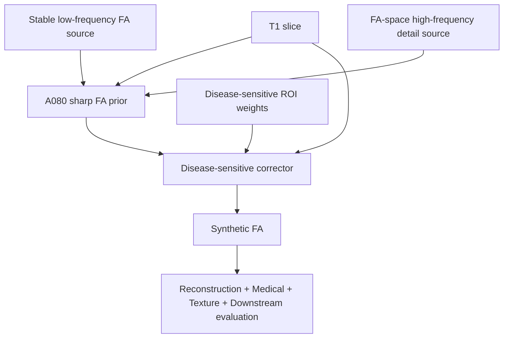
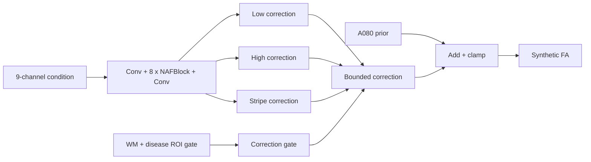

# Final Model Architecture Notes for Figures

This document summarizes the current final architecture for paper and PPT figures. It describes the fixed final method only; failed or exploratory branches should be shown only as ablations or design lessons.

## 1. Final Method

Recommended paper name:

**Frequency-aware sharp FA prior + Disease-sensitive high-frequency-preserving correction**

Internal final method name:

`ADNI_A080_DS_CORRECTOR_DISEASEROI_HFPRESERVE_FULL_E12_SCOREBEST`

Final prediction folder:

`outputs/icdm2026/predictions/ADNI_A080_DS_CORRECTOR_DISEASEROI_HFPRESERVE_FULL_E12_SCOREBEST`

Final metric file:

`outputs/icdm2026/metrics/ADNI_A080_DS_CORRECTOR_DISEASEROI_HFPRESERVE_FULL_E12_SCOREBEST_summary.json`

The final method has two stages:

1. **A080 sharp FA prior**: a frozen frequency-aware prior built by blending stable low-frequency FA structure with clipped FA-space high-frequency detail.
2. **Disease-sensitive high-frequency-preserving corrector**: a bounded correction module that improves WM/ROI fidelity while preserving the prior's texture.

Recommended figure-level pipeline:

`T1 slice -> A080 frequency-aware sharp FA prior -> disease-sensitive fidelity corrector -> synthetic FA`

## 2. Task Definition

Input:

- Single-slice T1 MRI.
- Single-channel input, confirmed by final `export_summary.json` with `stage1_channels=1`.
- Final test PNG size is confirmed as `224 x 224`.

Output:

- Single-channel synthetic FA image.

The synthetic FA should be described as a complementary white-matter representation, not as a replacement for real DTI/FA.

## 3. Overall Framework



Suggested color coding:

- T1 input: gray.
- A080 prior: blue.
- High-frequency branch: purple or cyan.
- WM/ROI constraints: green.
- Stage2 correction: orange.
- Final synthetic FA: grayscale.

## 4. A080 Sharp FA Prior

### 4.1 Frozen Prior, Not an Online Stage1 Checkpoint

In the final export:

- `coarse_pred_dir = outputs/icdm2026/predictions/ADNI_BLEND_LOWGUARD_LOW_LIGHTGUARD_HF_A080`
- `stage1_ckpt = ""`

Therefore, A080 should be drawn as a **frequency-aware prior construction module**, not as a single online U-Net or posterior-mean PMRF Stage1.

### 4.2 A080 Sources

Stable low-frequency source:

`outputs/icdm2026/predictions/ADNI_FIDELITY_FLOW_ARTIFACT_LOWGUARD_TEMPLATE_STRONG`

High-frequency detail source:

`outputs/icdm2026/predictions/ADNI_STAGE1_PRIOR_FLOW_LIGHTGUARD_4096_E8_BEST_K8`

Blend manifest:

`outputs/icdm2026/predictions/ADNI_BLEND_LOWGUARD_LOW_LIGHTGUARD_HF_A080/blend_manifest.csv`

Confirmed blend settings:

- `alpha = 0.8`
- `kernel = 9`
- `clip_delta = 0.06`

### 4.3 Blend Formula

Implementation:

`scripts/blend_highpass_detail.py`

Core operations:

```text
base_hp   = Base - LP(Base)
detail_hp = Detail - LP(Detail)
delta_hp  = clip(detail_hp - base_hp, -0.06, 0.06)
A080      = Base + 0.8 * delta_hp
```

Interpretation:

- `Base` preserves stable FA low-frequency structure and intensity space.
- `Detail` provides FA-space texture candidates.
- `clip_delta` controls local over-bright high-frequency artifacts.
- `alpha=0.8` is the current final balance point.

## 5. Disease-Sensitive Corrector

### 5.1 Code and Checkpoint

Training entry:

`pmrf_t1fa/train_pmrf_t1fa_stage2_ds_corrector.py`

Final checkpoint:

`outputs/adni_ds_corrector_from_a080_disease_roi_hfpreserve_full_e12/checkpoints/best_score_ds_corrector.pt`

Export script:

`scripts/export_ds_corrector_predictions.py`

Final settings:

- `variant = multihead`
- `epochs = 12`
- `batch_size = 2`
- `lr = 6e-5`
- `train_limit = 0`
- `val_limit = 0`
- `width = 48`
- `num_blocks = 8`
- `mixed_precision = bf16`
- `correction_scale = 0.08`
- `fid_eval_every = 0`

`train_limit=0` and `val_limit=0` mean the final Stage2 run used the full ADNI train/val split rather than a smoke subset.

### 5.2 Nine-Channel Condition

Implemented by:

`build_condition()` in `pmrf_t1fa/train_pmrf_t1fa_stage2_ds_corrector.py`

For the final `multihead` variant, the condition tensor has 9 channels:

| Channel | Meaning |
|---|---|
| 1 | T1 center slice |
| 2 | A080 coarse prior |
| 3 | coarse low-pass |
| 4 | coarse high-pass |
| 5 | T1 edge / high-pass residual |
| 6 | disease ROI map |
| 7 | uncertainty proxy `abs(t1_edge - coarse_high)` |
| 8 | x coordinate |
| 9 | y coordinate |

Figure shorthand:

```text
Condition = concat(T1, A080, LP(A080), HP(A080), Edge(T1),
                   DiseaseROIMap, |Edge(T1)-HP(A080)|, CoordX, CoordY)
```

### 5.3 Backbone

Implemented by:

`SingleSliceCorrector` in `pmrf_t1fa/train_pmrf_t1fa_stage2_ds_corrector.py`

Architecture:

```text
Conv2d(9 -> 48)
8 x NAFBlock(48)
Conv2d(48 -> 4)
```

For `variant=multihead`:

- Channels 1-3 are correction heads.
- Channel 4 is the uncertainty/log-sigma head.
- The final convolution is zero-initialized, so the module starts close to an identity correction.

### 5.4 Multi-Head Correction

Implemented by:

`compose_correction()` in `pmrf_t1fa/train_pmrf_t1fa_stage2_ds_corrector.py`

| Head | Role | Operation |
|---|---|---|
| Low correction | Low-frequency medical correction | `scale * LP(tanh(low_raw)) * gate` |
| High correction | Small high-frequency correction | `0.50 * scale * HP(tanh(high_raw)) * gate` |
| Stripe correction | Row/column artifact correction | `0.25 * scale * stripe_basis * brain_mask` |

Final image:

```text
correction = low_corr + high_corr + stripe_corr
final = clamp(A080 + correction, -1, 1)
```

The final `correction_scale` is `0.08`, so Stage2 is a bounded corrector rather than a full image generator.

### 5.5 Disease-Sensitive Gate

Implemented by:

`correction_gate()` in `pmrf_t1fa/train_pmrf_t1fa_stage2_ds_corrector.py`

For `multihead`:

```text
gate = brain_mask * (0.35 + 0.65 * clamp(wm_mask + roi_map, 0, 1))
```

This makes corrections stronger in white-matter and disease-sensitive regions while still allowing weak correction elsewhere inside the brain.

### 5.6 Disease-Sensitive ROI Weights

ROI file:

`outputs/icdm2026/roi_weights/adni_disease_sensitive_roi_weights_2x3_top4.csv`

This is a 2 x 3 data-driven grid ROI weighting scheme, not a fine anatomical atlas. Nonzero weights are:

| ROI | Weight |
|---|---:|
| r0_c1 | 0.7695 |
| r1_c0 | 0.7967 |
| r1_c1 | 1.0000 |
| r1_c2 | 0.8774 |

Recommended wording:

**data-driven disease-sensitive grid ROI weighting**

## 6. Loss Design

Implemented by:

`build_loss()` in `pmrf_t1fa/train_pmrf_t1fa_stage2_ds_corrector.py`

Final weights:

| Loss | Weight | Purpose |
|---|---:|---|
| final L1 | 0.16 | Reconstruction fidelity |
| final MSE | 0.06 | Intensity error control |
| final SSIM | 0.06 | Structural similarity |
| WM L1 | 1.05 | White-matter fidelity |
| ROI consistency | 0.8 | Regional consistency |
| disease ROI | 2.8 | Disease-sensitive ROI correction |
| correction L1 | 0.45 | Align bounded correction with target residual |
| bounded correction | 0.15 | Limit over-correction |
| sharp retention | 3.0 | Preserve A080 texture |
| stripe | 1.0 | Control stripe/row-column artifacts |
| HF preserve | 4.0 | Preserve high-frequency detail |
| uncertainty | 0.25 | Auxiliary uncertainty modeling |
| atlas smooth | 0.15 | Smooth correction field |

Suggested figure grouping:

1. Reconstruction fidelity: L1 / MSE / SSIM.
2. Medical fidelity: WM L1 / ROI / disease ROI.
3. Texture preservation: sharp retention / HF preserve.
4. Artifact control: stripe / bounded correction / smooth correction.

## 7. Shapes and Channels

| Module | Shape | Confirmation |
|---|---|---|
| T1 input | `[B, 1, 224, 224]` | Confirmed by PNG size and `stage1_channels=1` |
| FA target | `[B, 1, 224, 224]` | Confirmed by grayscale loading |
| A080 prior | `[B, 1, 224, 224]` | Confirmed prediction folder |
| Stage2 condition | `[B, 9, 224, 224]` | Confirmed by `build_condition()` and `SingleSliceCorrector(in_channels=9)` |
| Stage2 raw output | `[B, 4, 224, 224]` | Confirmed for `multihead`: 3 correction heads + 1 log-sigma |
| Correction | `[B, 1, 224, 224]` | Confirmed by `compose_correction()` |
| Final synthetic FA | `[B, 1, 224, 224]` | Confirmed by `final = clamp(A080 + correction, -1, 1)` |
| Downstream subject bag | `[n_slices, n_features]` | Partially confirmed; exact final feature count was not confirmed in the current file |

## 8. Result Evidence

ADNI final test set:

- `n_slices = 5616`
- `n_subjects = 108`

Final A080+DS Full metrics:

| Metric | Value |
|---|---:|
| PSNR | 28.8156 |
| SSIM | 0.9142 |
| MSE | 0.0014 |
| MAE | 0.0166 |
| WM-MAE | 0.0545 |
| ROI-CCC | 0.8423 |
| ROI-Spearman | 0.8531 |
| Sharpness Ratio | 1.0226 |
| WM Skeleton Error | 0.0737 |
| Slice Consistency Error | 0.0320 |
| Downstream ACC | 0.7100 |
| Downstream Macro-AUC | 0.7226 |
| Downstream Macro-F1 | 0.5931 |

Compared with A080 Base:

| Metric | A080 Base | A080+DS Full | Change |
|---|---:|---:|---:|
| PSNR | 28.3714 | 28.8156 | +0.4442 |
| SSIM | 0.9086 | 0.9142 | +0.0056 |
| WM-MAE | 0.0613 | 0.0545 | improved |
| ROI-CCC | 0.7677 | 0.8423 | +0.0746 |
| Sharpness Ratio | 0.9961 | 1.0226 | preserved/slightly increased |

This comparison supports the Stage2 story:

**Stage2 does not regenerate texture from scratch. It preserves the A080 prior's sharpness while improving reconstruction and medical consistency.**

## 9. Recommended Main-Text Figures

Use 4 main-text figures:

1. **Overall framework**
   - T1 -> A080 sharp FA prior -> DS corrector -> Synthetic FA.

2. **A080 prior construction**
   - Stable low-frequency source, FA-space detail source, clipped high-frequency delta.

3. **Disease-sensitive high-frequency-preserving corrector**
   - 9-channel condition, NAFBlock backbone, multi-head correction, ROI/WM gate.

4. **Quantitative and qualitative validation**
   - Method comparison panel and integrated metric table.

Appendix figures can include:

- Ablation/failed route summary.
- Private dataset results.
- Downstream protocol.

## 10. Recommended PPT Figures

Use 7 PPT figures:

1. Motivation: why synthesize FA from T1.
2. Design lessons: posterior mean blur, GAN over-brightness, unreliable T1 high-pass.
3. Final method concept.
4. A080 construction.
5. DS corrector architecture.
6. ADNI and private-dataset results.
7. Downstream utility and limitations.

## 11. Mermaid Drafts

### Overall Framework



### A080 Prior

```mermaid
flowchart LR
    B[Base prediction] --> BHP[HP(base)]
    D[Detail prediction] --> DHP[HP(detail)]
    BHP --> Delta[clip(HP_detail - HP_base)]
    DHP --> Delta
    Delta --> A080[A080 = Base + 0.8 * clipped delta]
```

### DS Corrector



## 12. Branches Not to Draw as the Final Method

Do not include these as final-model components:

- PMRF posterior-mean Stage1 + conservative Stage2.
- LPIPS+GAN sharp Stage1 as final main line.
- Direct T1 high-pass injection as final main line.
- CleanBase / LowGuard / Template WMMSGAN / MB-NAF WMGAN as final main line.
- StackUNet-based frequency fusion as final main line.

They can be summarized as design lessons or ablations only.

## 13. Details Not Fully Confirmed

1. The exact final downstream feature dimension was not confirmed in the current file. Use “slice-level ROI/statistical features aggregated at subject level” instead of a fixed feature count.
2. Disease-sensitive ROI is a 2x3 data-driven grid ROI, not a labeled anatomical atlas.
3. FID is inactive in the final Stage2 run because `fid_eval_every=0`; do not present FID as a final selection metric.
4. A080 is a folder-based frozen prior, not an end-to-end trainable online Stage1 module in the final export.

## 14. Safe Manuscript Wording

Recommended wording:

> The proposed method first constructs a frequency-aware sharp FA prior by blending stable low-frequency FA structure with clipped FA-space high-frequency detail. A disease-sensitive high-frequency-preserving corrector then applies bounded, ROI-gated corrections to improve white-matter and disease-sensitive regional consistency while preserving the sharp texture of the prior.

