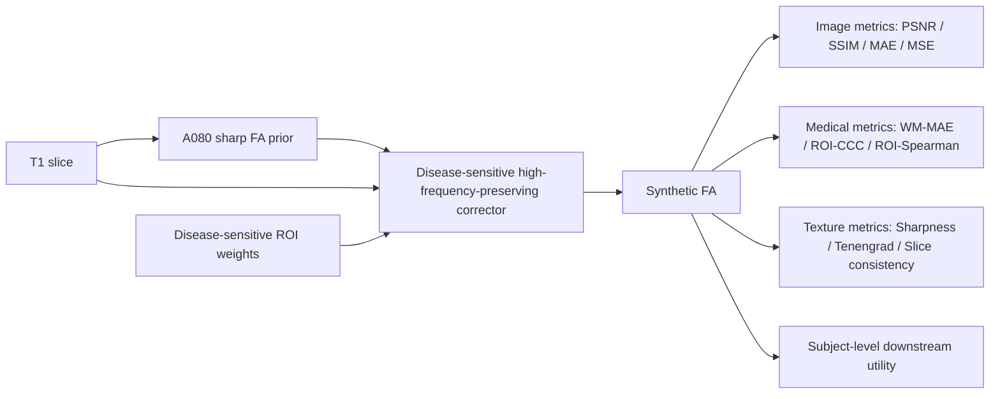
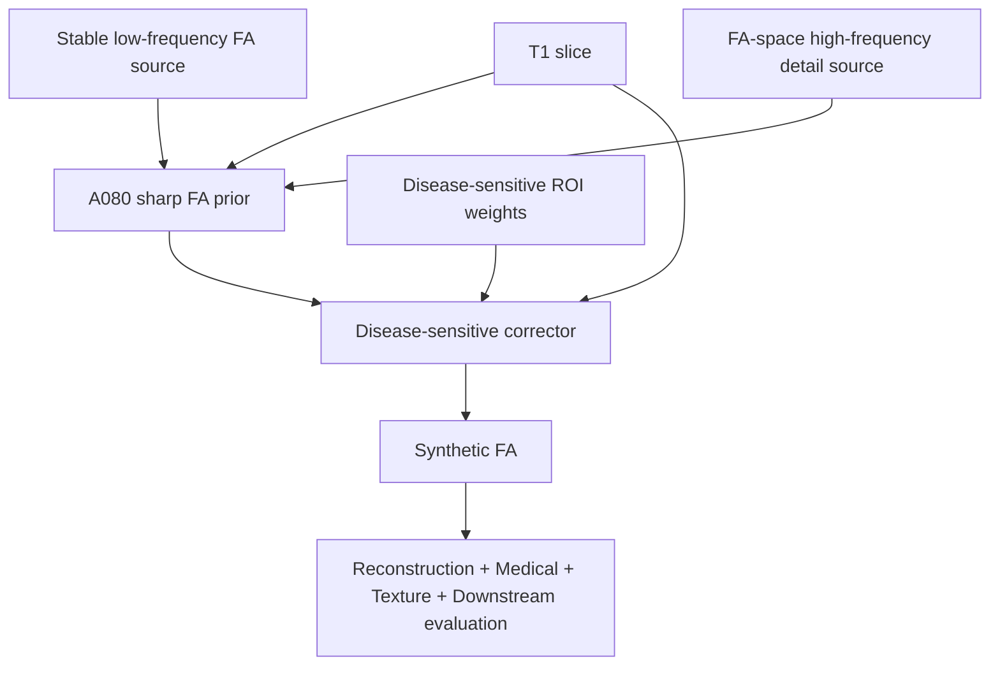
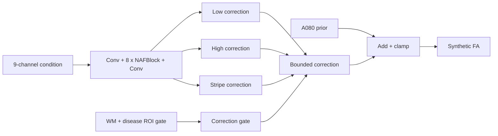

# 最终模型结构作图说明

本文档用于论文和 PPT 绘制当前最终模型结构图。它只描述当前固定主方法，不把已经否定的探索分支画成主线。

## 1. 最终主方法

推荐论文方法名：

**Frequency-aware sharp FA prior + Disease-sensitive high-frequency-preserving correction**

项目内部最终方法名：

`ADNI_A080_DS_CORRECTOR_DISEASEROI_HFPRESERVE_FULL_E12_SCOREBEST`

最终预测目录：

`outputs/icdm2026/predictions/ADNI_A080_DS_CORRECTOR_DISEASEROI_HFPRESERVE_FULL_E12_SCOREBEST`

最终评估文件：

`outputs/icdm2026/metrics/ADNI_A080_DS_CORRECTOR_DISEASEROI_HFPRESERVE_FULL_E12_SCOREBEST_summary.json`

最终模型分成两个阶段：

1. **A080 sharp FA prior**：由稳定低频 FA 图和 FA-space 高频纹理图做受限频域融合，得到清晰但仍需要医学一致性校正的 FA prior。
2. **Disease-sensitive high-frequency-preserving corrector**：在 A080 prior 上做小幅医学指标校正，重点提升 WM/ROI 一致性，同时保留高频纹理。

建议图中不要再称它为普通 PMRF Stage1/Stage2。更准确的表达是：

`T1 slice -> A080 frequency-aware sharp FA prior -> disease-sensitive fidelity corrector -> synthetic FA`

## 2. 任务定义

输入：

- 单切片 T1 MRI。
- 训练和导出使用单通道输入，最终 `export_summary.json` 中 `stage1_channels=1`。
- 最终测试 PNG 尺寸已确认是 `224 x 224`。

输出：

- 单通道合成 FA 图像。
- 输出 PNG 目录为 `outputs/icdm2026/predictions/ADNI_A080_DS_CORRECTOR_DISEASEROI_HFPRESERVE_FULL_E12_SCOREBEST`。

核心目的：

- 从 T1 生成清晰且医学一致的 FA 表征。
- 生成 FA 不应被表述为替代真实 DTI/FA，而应表述为 T1 的补充性白质结构表征。

## 3. 总体流程图

论文主图可以画成下面的结构：



图中建议用颜色区分：

- T1 输入：灰色。
- A080 prior：蓝色。
- 高频纹理支路：紫色或青色。
- Disease-sensitive ROI / WM 约束：绿色。
- Stage2 correction：橙色。
- 最终 Synthetic FA：黑白 FA 图像。

## 4. Stage 1 / A080 Sharp FA Prior

### 4.1 它不是最终在线训练的普通 Stage1

最终主方法中的 A080 prior 是 frozen prediction folder，不是一个在 `export_summary.json` 中在线调用的 `stage1_ckpt`。最终导出文件中：

- `coarse_pred_dir = outputs/icdm2026/predictions/ADNI_BLEND_LOWGUARD_LOW_LIGHTGUARD_HF_A080`
- `stage1_ckpt = ""`

因此论文图里建议把 A080 画成一个 **frequency-aware prior construction module**，而不是画成单一 U-Net 或单一 PMRF posterior mean predictor。

### 4.2 A080 的来源

A080 由两个预测源融合得到：

低频稳定源：

`outputs/icdm2026/predictions/ADNI_FIDELITY_FLOW_ARTIFACT_LOWGUARD_TEMPLATE_STRONG`

高频细节源：

`outputs/icdm2026/predictions/ADNI_STAGE1_PRIOR_FLOW_LIGHTGUARD_4096_E8_BEST_K8`

融合 manifest：

`outputs/icdm2026/predictions/ADNI_BLEND_LOWGUARD_LOW_LIGHTGUARD_HF_A080/blend_manifest.csv`

manifest 已确认：

- `alpha = 0.8`
- `kernel = 9`
- `clip_delta = 0.06`

### 4.3 A080 频域融合公式

实现文件：

`scripts/blend_highpass_detail.py`

核心代码位置：

- `base_hp = base - lowpass(base, args.kernel)`
- `detail_hp = detail - lowpass(detail, args.kernel)`
- `hp_delta = np.clip(detail_hp - base_hp, -args.clip_delta, args.clip_delta)`
- `blended = base + args.alpha * hp_delta`

可在图中写成：

```text
base_hp   = Base - LP(Base)
detail_hp = Detail - LP(Detail)
delta_hp  = clip(detail_hp - base_hp, -0.06, 0.06)
A080      = Base + 0.8 * delta_hp
```

含义：

- `Base` 提供稳定低频结构和亮度空间。
- `Detail` 提供 FA-space 纹理候选。
- `clip_delta` 防止局部高亮和假纹理爆发。
- `alpha=0.8` 是当前最终平衡点。

### 4.4 Stage1/A080 设计动机

之前已否定的路线说明了三个问题：

1. Posterior mean Stage1 指标稳定但会产生均值解，视觉上偏糊。
2. LPIPS+GAN 可以变清楚，但容易出现局部白质过亮和假纹理。
3. 直接 T1 high-pass 注入会把 T1 解剖边缘带入 FA 空间，纹理来源不够可靠。

A080 的设计目标是：

- 使用 FA-space 高频来源，而不是直接使用 T1 高频。
- 用稳定低频 base 保持 FA 亮度空间和整体结构。
- 用 clipped high-frequency delta 保留细节，同时压制局部过亮。

## 5. Stage 2 / Disease-Sensitive Corrector

### 5.1 训练入口和最终 checkpoint

训练入口：

`pmrf_t1fa/train_pmrf_t1fa_stage2_ds_corrector.py`

最终 checkpoint：

`outputs/adni_ds_corrector_from_a080_disease_roi_hfpreserve_full_e12/checkpoints/best_score_ds_corrector.pt`

最终导出脚本：

`scripts/export_ds_corrector_predictions.py`

最终导出 summary：

`outputs/icdm2026/predictions/ADNI_A080_DS_CORRECTOR_DISEASEROI_HFPRESERVE_FULL_E12_SCOREBEST/export_summary.json`

最终训练配置：

- `variant = multihead`
- `epochs = 12`
- `batch_size = 2`
- `lr = 6e-5`
- `train_limit = 0`
- `val_limit = 0`
- `width = 48`
- `num_blocks = 8`
- `mixed_precision = bf16`
- `correction_scale = 0.08`
- `fid_eval_every = 0`

`train_limit=0` 和 `val_limit=0` 表示最终 Stage2 使用完整 ADNI train/val split，而不是小样本 smoke test。

### 5.2 Corrector 输入条件

实现函数：

`build_condition()` in `pmrf_t1fa/train_pmrf_t1fa_stage2_ds_corrector.py`

最终 `multihead` variant 的条件通道数已确认是 9：

| 通道 | 含义 |
|---|---|
| 1 | T1 center slice |
| 2 | A080 coarse prior |
| 3 | coarse low-pass |
| 4 | coarse high-pass |
| 5 | T1 edge / high-pass residual |
| 6 | disease ROI map |
| 7 | uncertainty proxy = `abs(t1_edge - coarse_high)` |
| 8 | x coordinate |
| 9 | y coordinate |

图中可以画成：

```text
Condition = concat(
  T1,
  A080,
  LP(A080),
  HP(A080),
  Edge(T1),
  DiseaseROIMap,
  |Edge(T1)-HP(A080)|,
  CoordX,
  CoordY
)
```

### 5.3 Corrector 主干

实现类：

`SingleSliceCorrector` in `pmrf_t1fa/train_pmrf_t1fa_stage2_ds_corrector.py`

结构：

```text
Conv2d(9 -> 48)
8 x NAFBlock(48)
Conv2d(48 -> 4)
```

其中：

- `variant = multihead`
- 前 3 个输出通道是 correction heads。
- 第 4 个输出通道是 uncertainty/log-sigma head。
- 最后一层权重和 bias 初始化为 0，使 Stage2 初始状态接近 identity correction。

### 5.4 Multi-head correction

实现函数：

`compose_correction()` in `pmrf_t1fa/train_pmrf_t1fa_stage2_ds_corrector.py`

三个 correction head：

| Head | 作用 | 实现逻辑 |
|---|---|---|
| Low correction | 低频医学一致性校正 | `scale * LP(tanh(low_raw)) * gate` |
| High correction | 小幅高频校正 | `0.50 * scale * HP(tanh(high_raw)) * gate` |
| Stripe correction | 条纹/行列偏置校正 | `0.25 * scale * stripe_basis * brain_mask` |

最终输出：

```text
correction = low_corr + high_corr + stripe_corr
final = clamp(A080 + correction, -1, 1)
```

其中 `correction_scale = 0.08`，所以 Stage2 是小幅校正器，不是重新生成器。

### 5.5 Disease-sensitive gate

实现函数：

`correction_gate()` in `pmrf_t1fa/train_pmrf_t1fa_stage2_ds_corrector.py`

对于 `multihead`：

```text
gate = brain_mask * (0.35 + 0.65 * clamp(wm_mask + roi_map, 0, 1))
```

含义：

- correction 主要发生在脑组织内部。
- 白质区域和 disease-sensitive ROI 区域权重更高。
- 非关键区域仍允许小幅校正，但不会主导。

### 5.6 Disease-sensitive ROI 权重

ROI 权重文件：

`outputs/icdm2026/roi_weights/adni_disease_sensitive_roi_weights_2x3_top4.csv`

ROI 是 2 x 3 grid，不是外部解剖 atlas。非零权重为：

| ROI | weight |
|---|---:|
| r0_c1 | 0.7695 |
| r1_c0 | 0.7967 |
| r1_c1 | 1.0000 |
| r1_c2 | 0.8774 |

图中不要写成“精细解剖 atlas ROI”。更准确的说法是：

**data-driven disease-sensitive grid ROI weighting**。

### 5.7 Loss 设计

实现函数：

`build_loss()` in `pmrf_t1fa/train_pmrf_t1fa_stage2_ds_corrector.py`

最终权重来自 `export_summary.json`：

| Loss | 权重 | 目的 |
|---|---:|---|
| final L1 | 0.16 | 保持整体重建 |
| final MSE | 0.06 | 稳定强度误差 |
| final SSIM | 0.06 | 保持结构相似性 |
| WM L1 | 1.05 | 降低白质区域误差 |
| ROI consistency | 0.8 | 提升区域一致性 |
| disease ROI | 2.8 | 强化疾病敏感 ROI |
| correction L1 | 0.45 | 让 correction 指向 target-coarse |
| bounded correction | 0.15 | 限制过大改动 |
| sharp retention | 3.0 | 防止 Stage2 抹掉 A080 纹理 |
| stripe | 1.0 | 抑制条纹/行列伪影 |
| HF preserve | 4.0 | 保留 A080 高频纹理 |
| uncertainty | 0.25 | 辅助不确定性建模 |
| atlas smooth | 0.15 | 平滑 correction 场 |

图中建议把 loss 分成四类：

1. Reconstruction fidelity：L1 / MSE / SSIM。
2. Medical fidelity：WM L1 / ROI / disease ROI。
3. Texture preservation：sharp retention / HF preserve。
4. Artifact control：stripe / bounded correction / smooth correction。

### 5.8 Checkpoint 选优逻辑

实现函数：

`selection_score()` and `passes_gate()` in `pmrf_t1fa/train_pmrf_t1fa_stage2_ds_corrector.py`

选优关注：

- `delta_psnr`
- `delta_ssim`
- `delta_wm_l1`
- `delta_roi`
- `delta_disease_roi`
- `delta_stripe`
- `sharp_retention`

硬门槛：

- `sharp_retention >= best_min_sharp_retention`
- `delta_disease_roi >= best_min_delta_disease_roi`
- `delta_stripe >= -abs(best_max_delta_stripe)`

这说明最终 Stage2 的目的不是单纯最大化 PSNR，而是“医学一致性提升 + 高频保持 + 伪影控制”的综合选优。

## 6. 形状和通道表

| 模块 | 张量形状 | 是否确认 | 证据 |
|---|---|---|---|
| T1 input | `[B, 1, 224, 224]` | 已确认 | PNG 尺寸读取为 224x224；最终 `stage1_channels=1` |
| FA target | `[B, 1, 224, 224]` | 已确认 | 单通道 PNG 和训练脚本灰度读取 |
| A080 prior | `[B, 1, 224, 224]` | 已确认 | `coarse_pred_dir` PNG |
| Stage2 condition | `[B, 9, 224, 224]` | 已确认 | `build_condition()` + `SingleSliceCorrector(in_channels=9)` |
| Stage2 raw output | `[B, 4, 224, 224]` | 已确认 | `multihead` 输出 3 correction heads + 1 log-sigma |
| correction | `[B, 1, 224, 224]` | 已确认 | `compose_correction()` 汇总三个 correction head |
| final synthetic FA | `[B, 1, 224, 224]` | 已确认 | `refined = clamp(coarse + correction, -1, 1)` |
| Downstream subject bag | `[n_slices, n_features]` | 部分确认 | `scripts/evaluate_slice_mil_roi.py` 使用 subject bag；最终 feature 数未在当前文件中确认 |

## 7. 最终结果支撑

最终 ADNI 测试集：

- `n_slices = 5616`
- `n_subjects = 108`

最终主方法结果：

| Metric | A080+DS Full |
|---|---:|
| PSNR | 28.8156 |
| SSIM | 0.9142 |
| MSE | 0.0014 |
| MAE | 0.0166 |
| WM-MAE | 0.0545 |
| ROI-CCC | 0.8423 |
| ROI-Spearman | 0.8531 |
| Sharpness Ratio | 1.0226 |
| WM Skeleton Error | 0.0737 |
| Slice Consistency Error | 0.0320 |
| Downstream ACC | 0.7100 |
| Downstream Macro-AUC | 0.7226 |
| Downstream Macro-F1 | 0.5931 |

与 A080 Base 相比：

| Metric | A080 Base | A080+DS Full | 变化 |
|---|---:|---:|---:|
| PSNR | 28.3714 | 28.8156 | +0.4442 |
| SSIM | 0.9086 | 0.9142 | +0.0056 |
| WM-MAE | 0.0613 | 0.0545 | 改善 |
| ROI-CCC | 0.7677 | 0.8423 | +0.0746 |
| Sharpness Ratio | 0.9961 | 1.0226 | 保持/略升 |

这个对比最适合用于说明 Stage2 的实际作用：

**Stage2 不是负责重新造纹理，而是在保留 A080 清晰度的同时，把医学一致性和重建指标拉回来。**

## 8. 与对比方法的画法

建议在论文图或 PPT 中只突出三类对比：

1. **Smooth but stable**：U-Net / posterior-mean 类型，PSNR/SSIM 可接受但 Sharpness 低。
2. **Sharp but unstable**：LPIPS+GAN 或旧 sharp Stage1，清晰但可能出现局部高亮/假纹理。
3. **Balanced final method**：A080+DS Full，兼顾 reconstruction、WM/ROI、sharpness。

不要写“所有指标第一”。更稳妥的论文表述：

> A080+DS Full achieves the best integrated balance across reconstruction fidelity, white-matter/ROI consistency, and sharpness preservation.

中文：

> A080+DS Full 在重建质量、白质/ROI 医学一致性和清晰度保持之间取得了最好的综合平衡。

## 9. 推荐论文主文图

建议主文放 4 张图：

1. **Figure 1: Overall framework**
   - T1 -> A080 sharp FA prior -> DS corrector -> Synthetic FA。
   - 同时标注 image metrics、medical metrics、texture metrics、downstream utility。

2. **Figure 2: A080 prior construction**
   - Base low-frequency source。
   - Detail high-frequency source。
   - `delta_hp = clip(HP(detail)-HP(base))`。
   - `A080 = base + 0.8 * delta_hp`。

3. **Figure 3: Disease-sensitive high-frequency-preserving corrector**
   - 9-channel condition。
   - NAFBlock backbone。
   - low/high/stripe multi-head correction。
   - disease ROI gate。
   - final = A080 + bounded correction。

4. **Figure 4: Quantitative and qualitative validation**
   - 横向可视化：T1 / FA_GT / U-Net / Pix2Pix / Old Fidelity Flow / A080 Base / A080+DS Full。
   - 下方放 error map 或 high-pass map。
   - 右侧或单独表格放 integrated comparison。

附录可放：

- Ablation and failed routes summary。
- Private dataset result table。
- Downstream task protocol。

## 10. 推荐 PPT 图

PPT 可以拆成 7 张：

1. Problem motivation：为什么需要 T1 -> FA。
2. Failed routes and lessons：posterior mean 糊、GAN 过亮、T1 high-pass 不可靠。
3. Final idea：FA-space sharp prior + disease-sensitive correction。
4. A080 construction：低频稳定源 + 高频细节源。
5. DS corrector structure：9-channel condition + multihead correction。
6. Results：A080 Base vs A080+DS Full vs baselines。
7. Clinical/downstream utility：subject-level downstream + limitations。

## 11. 可直接用于画图的 Mermaid 草图

### Figure 1



### Figure 2

```mermaid
flowchart LR
    B[Base prediction] --> BLP[Low-pass / high-pass split]
    D[Detail prediction] --> DLP[Low-pass / high-pass split]
    BLP --> Delta[clip(HP_detail - HP_base)]
    DLP --> Delta
    Delta --> Blend[A080 = Base + 0.8 * clipped delta]
```

### Figure 3



## 12. 不应画入主方法的旧分支

以下分支可以作为 ablation 或 exploratory notes，不建议画进主模型图：

- PMRF posterior-mean Stage1 + conservative Stage2。
- LPIPS+GAN sharp Stage1 作为最终主线。
- T1 high-pass direct injection 作为最终主线。
- CleanBase / LowGuard / Template WMMSGAN / MB-NAF WMGAN 作为最终主线。
- Frequency Fusion with StackUNet low-frequency branch。

原因：

- 它们要么已经被当前最终方法替代，要么是失败/过渡分支。
- 如果画进主图，会让审稿人误解最终模型依赖更多模块。

## 13. 当前未确认或需谨慎表述的点

1. 下游 subject bag 的最终特征维度未在当前文件中确认。可以写“slice-level ROI/statistical features aggregated at subject level”，不要写死维度。
2. Disease-sensitive ROI 是 2x3 grid ROI 权重，不是严格解剖 atlas 分割。
3. FID 在最终 Stage2 设置中 `fid_eval_every=0`，不是最终 checkpoint 选优指标。可以作为可选自然图像感知指标提及，但不要作为主评估。
4. A080 的 base/detail 来源是 prediction folders，不是一个单一可端到端反传的 Stage1 网络。
5. 私有集最终主方法是 `PRIVATE_DS_HYBRID`，和 ADNI 的 A080+DS Full 不是完全相同命名；双数据集论文要区分 dataset-specific final candidate。

## 14. 推荐论文安全表述

英文：

> The proposed method first constructs a frequency-aware sharp FA prior by blending stable low-frequency FA structure with clipped FA-space high-frequency detail. A disease-sensitive high-frequency-preserving corrector then applies bounded, ROI-gated corrections to improve white-matter and disease-sensitive regional consistency while preserving the sharp texture of the prior.

中文：

> 本方法首先通过稳定低频 FA 结构和受限 FA-space 高频细节融合，构建 frequency-aware sharp FA prior；随后使用 disease-sensitive high-frequency-preserving corrector 在该 prior 上进行小幅、ROI-gated 的医学一致性校正，以提升白质和疾病敏感区域一致性，同时保留 prior 中的清晰纹理。

